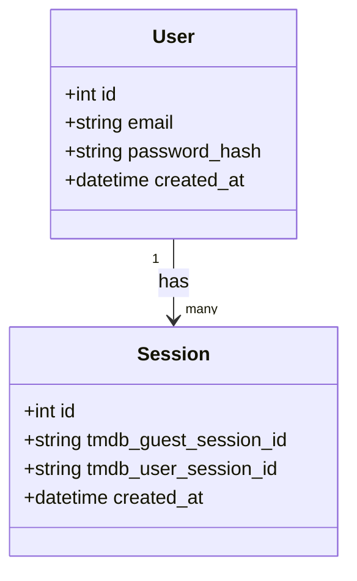

<p align="center">
  
</p>

This project uses The Movie Database (TMDB) API but is not endorsed or certified by TMDB.


# TMDB Companion API

## Author: Taylor Poe

```
TMDB_Custom_API/
├── api/
│   ├── __init__.py
│   ├── app.py                  # Flask app entry point
│   ├── config.py               # Environment & Swagger config
│   ├── extensions.py           # DB, cache, socket setup
│   ├── tmdb_client.py          # TMDB API wrapper
│   ├── routes/
│   │   ├── __init__.py
│   │   ├── health.py           # Health check endpoints
│   │   ├── auth.py             # Guest & user session auth
│   │   ├── movies.py           # Movie searching and details
│   │   ├── tv.py               # TV show searching and details
│   │   └── trending.py         # Trending movies and tv
│   └── models/
│       ├── __init__.py
│       ├── user.py             # User model
│       └── session.py          # Session persistence
│
├── sql/
│   ├── create_tables.sql       # Database schema
│   └── indexes.sql             # Database indexes
│
├── tests/
│   ├── test_health.py          # Health endpoint test
│   └── test_user.py            # User/session tests
│
├── Design Documents/
│   ├── 00_project_proposal.md
│   ├── 01_api_documentation.md # API overview
│   ├── 02_database_uml.mmd     
│   ├── 03-wireframes.md        
│   └── images/
│       └── primary_logo.svg    # TMDB branding and data credit -- thank you TMDB
│
├── TMDB Companion API.postman_collection.json
├── README.md
├── requirements.txt
├── .gitignore
├── .env                        # Local venv secrets (not committed)
│
├── node_modules/               
├── package.json
└── package-lock.json
```


A Flask-based REST API that proxies and extends The Movie Database (TMDB), providing movie and TV discovery, search, trending data, and session management.
The application runs fully locally with PostgreSQL and is tested via Postman.

## Tech Stack

```
Python 3
Flask
PostgreSQL
SQLAlchemy
Flasgger (Swagger UI)
Flask-Caching
TMDB API (v3 + v4 auth)
Postman
```

## Quick Start

### Clone the repository
```
git clone <http://github.com/TPoe25/TMDB_Custom_API>
cd TMDB_Custom_API
```
## Create and activate virtual environment
```
python3 -m venv venv
source venv/bin/activate
```
## Install dependencies
```
pip install -r requirements.txt
```
# Configure environment variables

## Create a .env file in the project root

```
TMDB_API_KEY=your_tmdb_api_key
TMDB_READ_TOKEN=your_tmdb_read_access_token
DATABASE_URL=postgresql://localhost/tmdb_api
SECRET_KEY=dev_secret
```

# Do not commit .env — it is ignored by .gitignore

# How to run

activate venv

```
source /Users/taylorpoe/Projects/TMDB_Custom_API/TaylorMDB/bin/activate
```

activate postgres

```
/opt/homebrew/opt/postgresql@15/bin/psql postgres
```

merge api and sql table

```
psql tmdb_api < sql/create_tables.sql
```

merge api and sql indexes

```
psql tmdb_api < sql/indexes.sql
```

script to start and test if user exists

```
source TaylorMDB/bin/activate                         
python scripts/seed_test_user.py
python api/app.py
```

## Seed a test user:(guest)

```
python scripts/seed_test_user.py
```

## Run the API

```
python api/app.py
```

-- The server will start at:

```
http://localhost:5000
```

## API Documentation (Swagger)

-Swagger UI is available at:

```
http://localhost:5000/apidocs
```

All endpoints are documented and testable from the browser.

## Testing with Postman

A Postman collection is included:

```
TMDB_Companion_API.postman_collection.json
```

#### Testing on Postman

```
GET /health
GET /auth/guest-session
GET /trending/all
GET /trending/movies
GET /trending/tv
GET /movies/550
GET /movies/550/recommendations
GET /tv/1399
```

### Performance & Caching

Read-only endpoints (trending, movie details, TV details) are cached for 5 minutes using in-memory caching to reduce TMDB API calls and improve response time.

### Security Notes

TMDB credentials are loaded via environment variables

No secrets are committed to source control

Authentication endpoints are not cached

### Python Version

```
- This project is developed and tested with **Python 3.11**
- Python 3.13+ is not supported by psycopg2 at this time.
```


## Diagrams


